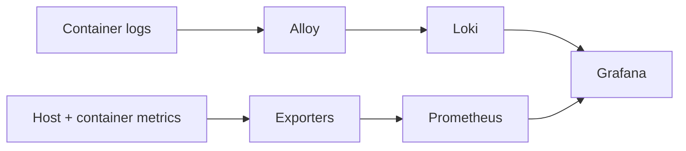
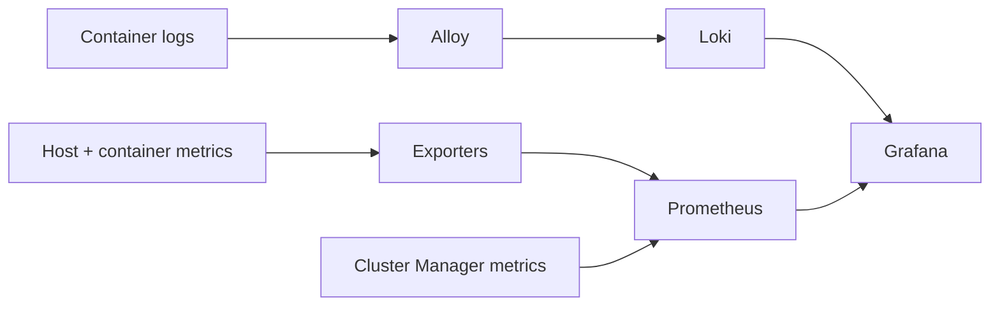
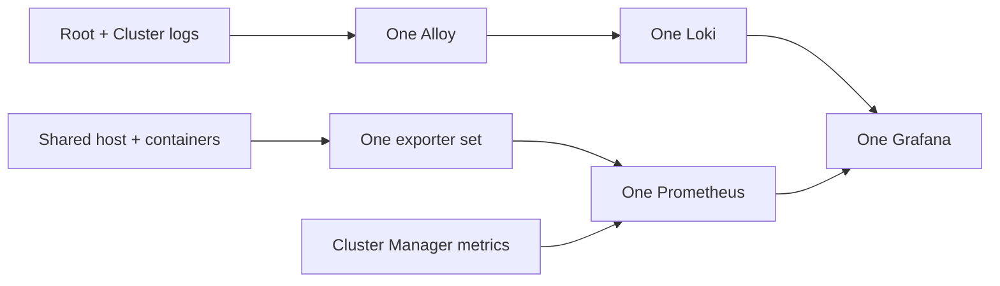

## Standalone Root





## Standalone Cluster





## 1-DOC: Root and Cluster on one host





These are alternative deployments, not a single central pipeline. Each Grafana queries the Loki and Prometheus in its own deployment.

Alloy uses `discovery.docker` and `loki.source.docker` against the local Docker socket. It refreshes discovery every five seconds, processes each line, and pushes it to the Loki in the same deployment. Prometheus scrapes local targets every 15 seconds with a 10-second timeout. Root Prometheus scrapes itself, node_exporter, cAdvisor, and the Docker-state exporter. Cluster and 1-DOC Prometheus also scrape Cluster Manager application metrics.

cAdvisor measures resource use but cannot supply Docker's automatic restart-policy counter. The Docker-state exporter supplies running state and restart counts. A startup-generated node_exporter textfile records the desired replica count from resolved Compose configuration, allowing a container that never started to be detected.

## Root, Cluster, and 1-DOC boundaries

| Deployment | Logs | Metrics | Grafana |
| --- | --- | --- | --- |
| Standalone Root | Root containers → Root Alloy → Root Loki | Root host and managed Root containers → Root Prometheus | Port `3000` |
| Standalone Cluster | Cluster containers → Cluster Alloy → Cluster Loki | Cluster host and managed Cluster containers → Cluster Prometheus | Port `3001` |
| 1-DOC | Root, local Cluster, and shared containers → one Alloy → one Loki | One physical host and managed 1-DOC containers → one Prometheus | Port `3000` |

The Root does not collect a remote Cluster's logs or metrics. Open that Cluster's Grafana to inspect its local data. A standalone dashboard's **Cluster** selector can therefore have only one value. In 1-DOC, Root and Cluster services share one Docker host and one observability pipeline; the physical host is measured only once.

Container and host identities are explained in [Labels and severity](../labels-and-severity/). For how to inspect these pipelines, use the [Observability manuals](../../../manuals/observability/overview/).
